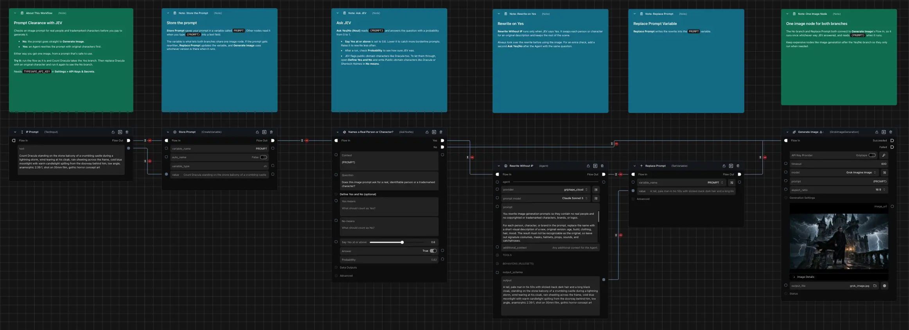
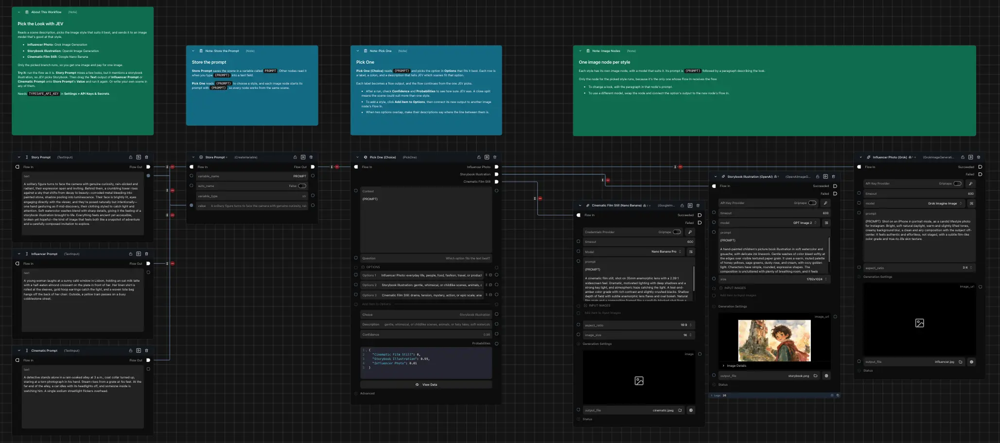

# JEV for Griptape Nodes

Nodes for asking [TypeSafe](https://typesafe.ai)'s JEV model questions about text, and routing your flow based on the answer.

JEV doesn't write text. You give it some text and a narrow question, and it returns a typed answer with a probability. That makes it good for decisions inside a flow: is this prompt safe, does this message ask for a refund, is this caption about a person.

## Nodes

### Ask Yes/No (Noul)

Asks a yes/no question about some text and sends the flow down the **Yes** or **No** branch.



| Parameter | What it does |
|---|---|
| **Context** | The text to ask about. Type it in or connect any text output. JSON works too. It also has an output, so you can pass the same text on to the next node. |
| **Question** | A yes/no question about the context, such as "Does the customer ask for a refund?" |
| **Yes means** / **No means** | Optional, in the collapsed **Define Yes and No** group. Short descriptions of what should count as yes and as no. Fill in either or both. |
| **Say Yes at or above** | How sure JEV must be before the flow takes the Yes branch. The default is 0.5. Raise it to say Yes only when JEV is very sure. Lower it to say Yes on weaker signals. |
| **Answer** | True or false. |
| **Probability** | JEV's probability that the answer is yes, from 0 to 1. A value near 0.5 means yes and no are about equally likely. |

The collapsed **Data Outputs** group works like the If/Else node. Connect something to **Data if Yes** and **Data if No**, and **Output** passes along whichever matches the answer. Everything connected to those two inputs runs before the question is asked, whichever way the answer goes. If one of them is expensive, like an image generation, put it after the branch instead.

The collapsed **Advanced** group has the model choice. `jev-latest` is the newest stable model and is the right choice for most flows.

### Pick One (Choice)

Picks the option that best fits some text and sends the flow down that option's branch.



| Parameter | What it does |
|---|---|
| **Context** | The text to ask about, the same as in Ask Yes/No. It also has an output. |
| **Question** | Optional. What JEV should decide, such as "Which department should handle this note?" |
| **Options** | One option per row. Click **Add item to Options** for a new row. Write a short label like `Lighting`, or add a description after a colon, like `Lighting: notes about lights, shadows, or exposure`. |
| **Choice** | The label JEV picked. |
| **Description** | The description of the option JEV picked, the text after its colon. Empty if that option has no description. |
| **Confidence** | How sure JEV is of its pick, from 0 to 1. A low value means the text could fit another option too. |
| **Probabilities** | JEV's probability for every option, keyed by label. |

Each option gets its own flow output, labeled to match. Connect each one to the node that should run for that option. You can rename, reorder, or delete options, and the wires stay with their option. Deleting an option also deletes its wires.

Each row in **Options** has its own output too, which carries that row's text. Connect it to a node on that option's branch, such as an Agent's context, to pass the option along.

The collapsed **Advanced** group has the model choice.

### Rate (Score)

Rates some text against levels you describe and sends the flow down the branch for the level it scores.

| Parameter | What it does |
|---|---|
| **Context** | The text to rate, the same as in Ask Yes/No. It also has an output. |
| **Question** | Optional. What JEV should rate, such as "How urgent is this message?" |
| **Levels** | One level per row, lowest first, up to 10. The first row is level 1, the next is level 2, and so on. Describe the situation at each level, like `Cosmetic issue, nothing is broken`, `Broken, but a workaround exists`, `Blocks people from working`. To name a level, put a label before a colon, like `Minor: broken, but a workaround exists`. |
| **Score** | JEV's score. It weighs every level by its probability, so it can fall between levels, like 1.7. |
| **Level** | The score rounded to the nearest level, as a whole number. |
| **Level Description** | The description of that level. |
| **Confidence** | How sure JEV is of its score, from 0 to 1. |
| **Probabilities** | JEV's probability for every level, keyed by level number. |

Each level gets its own flow output. A level with a label uses it, like **Minor**. A level without one is named by its number, like **Level 1**. The flow takes the output for **Level**, the rounded score. Only the description after the colon is sent to JEV, so labels don't affect the score.

To make a gate, connect several levels to the same node. For example, connect the top two levels to the node that escalates a ticket, and the rest to the node that files it. Levels you leave unconnected end the flow there.

Every data output is set on every run, whichever branch the flow takes.

Read **Probabilities** and **Confidence** alongside **Score**. A score of 2.0 can mean JEV is sure of level 2, or that it's split evenly between levels 1 and 3.

The collapsed **Advanced** group has the model choice.

## Tips for good questions

- Ask one narrow thing per question. "Does the message ask for a refund?" works better than "Is this a refund request that needs urgent attention?"
- Give JEV everything it needs in the Context. It only sees what you connect.
- Most questions don't need **Yes means** and **No means**. Use them when the line between yes and no is subtle. For "Has the customer contacted support before?", does mentioning it once in passing count? Say so in **Yes means**. Try a few real examples with and without them, and keep whichever works better.
- For structured context, use JSON and refer to fields with backticks, such as "Does `ticket.body` mention a duplicate charge?"
- To pick a value for **Say Yes at or above**, run a few real examples and look at the **Probability** output.
- For **Pick One**, make the options distinct. If two options overlap, add descriptions that say where the line between them is. Labels can't contain a colon, because everything after the first colon is the description.
- For **Rate**, describe situations, not degrees. `Broken, but a workaround exists` works. `Moderately severe` doesn't, and plain numbers like `0`, `1`, `2` work worst of all. JEV judges each level on its own, without seeing its number or its neighbors.
- Rate one thing per question. To judge several things, like severity and tone, use one Rate node for each.
- Empty rows in **Levels** are skipped, so the rows after one move down a level.

## Limits

- **Text only.** JEV can't read images, audio, or video. To ask about an image, describe it first with a node like **Describe Image**, then connect that description to **Context**.
- **English works best.** Other languages work but are less accurate.
- **64k tokens per request**, covering the context and the question.

## Installation

1. Clone this repository into your Griptape Nodes workspace:

   ```bash
   cd `gtn config show workspace_directory`
   git clone https://github.com/<your-org>/griptape-nodes-library-jev.git
   ```

2. In the Griptape Nodes editor, open **Settings > Libraries**, click **+ Add Library**, and enter the path to `griptape-nodes-library-jev/griptape-nodes-library.json` in your workspace. Then click **Refresh Libraries**.

3. Get an API key at [console.typesafe.ai/keys](https://console.typesafe.ai/keys), then add it as `TYPESAFE_API_KEY` in **Settings > API Keys & Secrets**.

The nodes appear under the **JEV** category.

## Troubleshooting

- **"TYPESAFE_API_KEY is not set"**: add the key in **Settings > API Keys & Secrets**, using exactly that name.
- **"TypeSafe rejected the API key"**: the key is wrong or has been revoked. Create a new one at [console.typesafe.ai/keys](https://console.typesafe.ai/keys).
- **An image won't connect to Context**: JEV reads text only. See **Limits** above.

## Development

See [CONTRIBUTING.md](CONTRIBUTING.md). For local runs, copy `.env.example` to `.env` and fill in `TYPESAFE_API_KEY`.

## License

Apache License 2.0. See [LICENSE](LICENSE).
